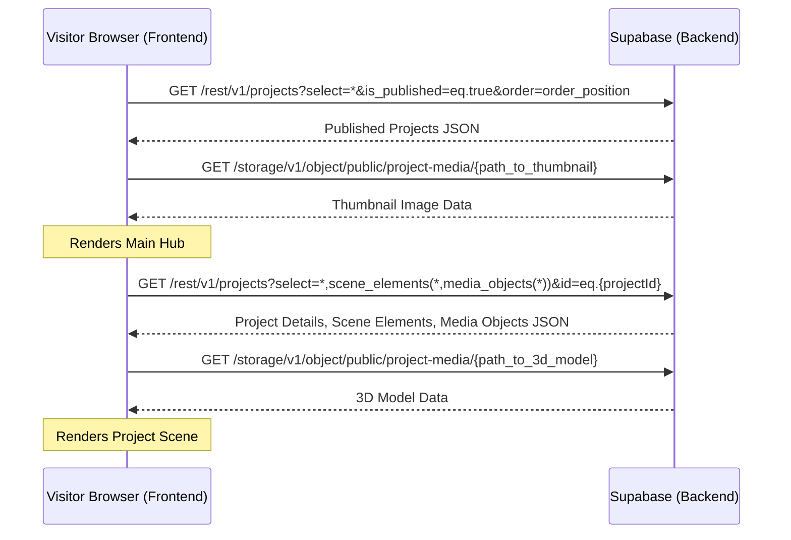
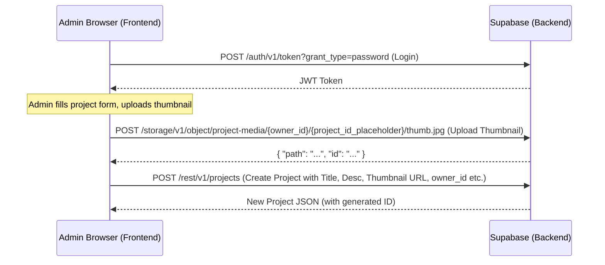

# Application Flow: Minimal 3D Portfolio (v2)

This document describes the key user and data flows within the application.

## 1. User Flows

### 1.1. Visitor: Exploring the Portfolio

1.  **Entry:** Visitor lands on the main portfolio URL (e.g., `yourdomain.com`).
2.  **Main Hub Load:**
    *   Frontend requests main `world_configuration` data from Supabase (lighting, background).
    *   Frontend requests list of published `projects` from Supabase.
    *   Relevant `media_objects` (thumbnails, main hub 3D assets) are loaded from Supabase Storage.
    *   The main 3D hub scene is rendered using React Three Fiber.
3.  **Navigation in Main Hub:**
    *   Visitor uses mouse/touch to interact with the 3D scene (orbit controls, zoom).
    *   Representations of projects (e.g., interactive 3D icons, cards) are displayed.
4.  **Selecting a Project:**
    *   Visitor clicks on a project representation.
    *   Frontend identifies the selected `project_id`.
5.  **Project View Load:**
    *   URL might change to `/project/:projectId`.
    *   Frontend requests detailed data for the selected `project` from Supabase.
    *   Frontend requests `scene_elements` associated with this `project_id` from Supabase.
    *   Relevant `media_objects` (3D models, images, videos for this project) are loaded from Supabase Storage.
    *   The specific project's 3D scene is rendered.
6.  **Interacting with Project View:**
    *   Visitor explores the project's 3D environment.
    *   Interactions with `scene_elements` (e.g., clicking a hotspot to show info, playing a video) trigger frontend actions.
7.  **Navigating Back/Elsewhere:**
    *   Visitor uses UI buttons or browser navigation to return to the main hub or another project.

### 1.2. Administrator: Managing Portfolio Content

1.  **Access Admin Panel:**
    *   Admin navigates to the admin URL (e.g., `yourdomain.com/admin`).
2.  **Login:**
    *   If not logged in, admin is presented with a login form.
    *   Admin enters credentials (email/password).
    *   Frontend sends credentials to Supabase Auth.
    *   Supabase Auth verifies credentials and returns a JWT on success.
    *   Frontend stores the JWT and redirects to the admin dashboard.
3.  **Admin Dashboard View:**
    *   Dashboard displays an overview (e.g., list of projects).
    *   Data is fetched from Supabase, filtered by `owner_id` using RLS.
4.  **Managing Projects:**
    *   **Create:**
        1.  Admin clicks "Add New Project."
        2.  Fills out project details form (title, description, etc.).
        3.  Uploads thumbnail image (to Supabase Storage).
        4.  Submits form. Frontend sends data to Supabase to create a new `projects` record.
    *   **Edit:**
        1.  Admin selects an existing project.
        2.  Form is pre-filled with project data from Supabase.
        3.  Admin modifies details and submits. Frontend sends data to update the `projects` record in Supabase.
    *   **Delete:**
        1.  Admin selects a project and confirms deletion.
        2.  Frontend sends request to delete the `projects` record (and associated data like `scene_elements`, `media_objects` via cascades or service logic) from Supabase.
5.  **Managing Media Objects (within a Project context or globally):**
    *   Admin navigates to a project's media management section.
    *   **Upload:**
        1.  Admin selects files (3D models, images, videos).
        2.  Frontend uploads files directly to Supabase Storage (e.g., to a path like `owner_id/project_id/filename`).
        3.  On successful upload, frontend creates/updates a `media_objects` record in Supabase with file details and storage path.
    *   **Delete:** Admin deletes a media object. The file is removed from Supabase Storage, and the `media_objects` record is deleted.
6.  **Configuring Scene Elements (for a Project):**
    *   Admin selects a project to edit its 3D scene.
    *   A UI (possibly a simplified 3D editor view or a form-based interface) allows:
        *   Adding new elements (e.g., "Add 3D Model," "Add Image Plane").
        *   Selecting existing `media_objects` to place in the scene.
        *   Modifying transform (position, rotation, scale) and properties of `scene_elements`.
    *   Changes are saved as `scene_elements` records in Supabase, linked to the project.
7.  **Managing World Configurations (Global/Project):**
    *   Admin adjusts settings like background, lighting.
    *   Changes are saved to `world_configurations` records in Supabase.
8.  **Logout:**
    *   Admin clicks "Logout."
    *   Frontend calls Supabase Auth to invalidate the session/token.
    *   Frontend clears stored JWT and redirects to login page.

## 2. Data Flows (Frontend <-> Supabase)

### 2.1. Reading Data (Public Portfolio)

### 2.2. Writing Data (Admin Panel - Example: Create Project)

This flow assumes the `project_id` for storage path might be generated client-side or a placeholder used, then potentially updated if the server generates the ID. Simpler is to save project record first, get ID, then upload media to path with that ID.

### 2.3. Authentication Data Flow

1.  **Login:** Frontend `supabase.auth.signInWithPassword()` -> Supabase Auth.
2.  **Session Management:** `supabase.auth.onAuthStateChange()` used by frontend to monitor session.
3.  **Authenticated Requests:** Frontend includes JWT in `Authorization: Bearer <token>` header for all API calls to tables with RLS. `supabase-js` client handles this automatically.
4.  **Logout:** Frontend `supabase.auth.signOut()` -> Supabase Auth. 